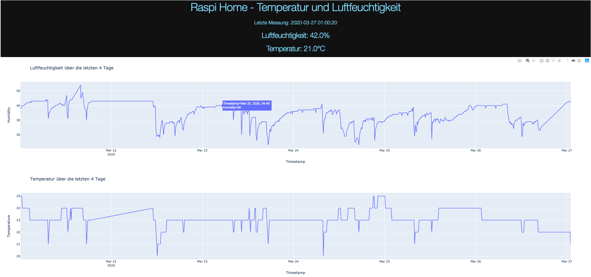

# Smarthome-Raspi-DHT11
Get room temperature and humidity with DHT11 via a Raspberry Pi and persist data in Firebase. Pull Data from Firebase and visualize Data by using the Python Dash Framework. When the humidity is above 40% for more than one hour, the app sends a message to my girlfriend and me via Telegram  

## How to run
1. Follow the [Adafruit Library](https://github.com/adafruit/Adafruit_Python_DHT) instructions to get Sensor data. 
2. Run the Dash App: `python app.py`
3. Run the Notification Manager: `python NotificationManager.py`

(The firebase credential file is excluded and the telegram token is revoked)

## Technology
* Raspberry Pi with DHT 11, evaluation with Adafruit Library
* I used Google Firebase (Cloud Firestore) to store and read the sensor data. They have a good api and reasonable free plans.
* Dash for Data Visualization
* Telegram API for notifications (e.g. Open the window)
